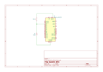

# Dynamic Blink

## Overview

This example turns ON / OFF the built-in LED periodically. The interval can be modified using a button without interruption.

* When the button is pressed, it starts calculating duration using [`millis()`](https://www.arduino.cc/reference/en/language/functions/time/millis/).
* The built-in LED still keep blinking.
* When the button is released, the duration is set to the interval.

## Hardware Required

* Arudino Board
* Momentary button
* 10k ohm resistor

## Schematic

