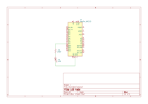

# LED Fade

## Overview

This example demonstrates an analog output (PWM) to fade an LED.

* See also the official example: [Built-in Examples > Analog > Fading](https://docs.arduino.cc/built-in-examples/analog/Fading).

## Hardware Required

* Arduino UNO
* 200 ohm resistor
* LED

## Schematic

