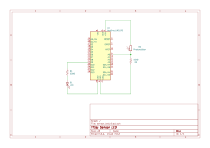

# Sensor LED

## Overview

This example demonstrates how to map an analog sensor value to the LED brightness.

* The lower the sensor value become, the brighter the LED gets.
  * This example uses a photoresistor, so the LED will get brighter in the dark.
* To detect min / max sensor values, a calibration step is made on the setup function.

## Hardware Required

* Arudino Board
* Photoresistor
* 10k ohm resistor
* LED
* 220 ohm resistor

## Schematic

